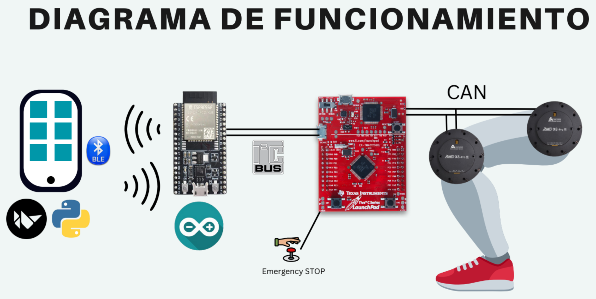

# ExoBoost 🦿

#### Este proyecto se llevó a cabo desde Junio hasta Diciembre del 2024 como parte del Proyecto de Evaluación Final para las carreras de Ingeniería en Mecatrónica, Biomédica y Diseño Automotriz, bajo la supervisión del Dr. Mario Jorge Claros Salgado en la Universidad de Monterrey.
#### Tiene el objetivo de generar el diseño y desarrollo de un prototipo exoesqueleto de asistencia a la marcha en cadera, rodilla y tobillo; idealmente enfocado en usuarios con movilidad limitada. 
#### Este repositortio describe las instrucciones para entender el funcionamiento general del sistema, desde requerimentos necesarios (tanto de hardware como software) hasta el cómo colaborar. Se explica de manera general la lógica de la interfaz de comunicación, esquema de control y el funcionamiento del software del prototipo. Detalles específicos se cubrirían en cada sección respectiva. 

## Funcionamiento general

## Requerimientos de Software 

* Windows 10+
* Ubuntu 22.04 
* Android SDK (V. 31)
* Python (v. 3.12)
* Java JDK (v. 17)
* Arduino IDE (v. 2.3.2)
* Energia IDE (v. 1.8.1)

## Requerimientos de Hardware 

* Celular con Android 12 (con Android SDK v. 31) en modo de desarrollador. 
* ESP32 Wroom development
* TivaC con arquitectura TM4123C
* CAN transceiver MCP 2551  
* Servoactuador brushless RMD X8 Pro
* MOTOR 2
* MOTOR 3

## App Móvil 📱

#### Seguir las instrucciones dentro del directorio _app_. Interfaz gráfica con la que el usuario puede interactuar el dispositivo. Con ella puede controlar el prototipo, así como garantizar que esté funcionando correctamente. Se conecta por Bluetooth Low Energy (BLE) como cliente a un servidor generado en una ESP32. 

## BLE Server en ESP32 

#### Seguir las instrucciones dentro del directorio _server_. Este microcontrolador funge el rol de antena BLE para el resto del sistema de control y comunicación. Procesa y transmite los datos recibidos como un máster de I2C a una TivaC por extremidad. 

## Sistema de control en tiempo real en TivaC 

#### Seguir las instrucciones dentro del directorio _control_. Este microcontrolador es reponsable de controlar cada motor dentro de una extremidad. Recibe comandos específicos y set points a través de un BUS I2C configurado como esclavo y ejecuta los comandos específicos de control a través de un BUS de CAN en el cual están conectados los motores.

## Documentación 📖

#### Puedes encontrar información más específica del proyecto en la [Tesis](https://github.com/tu/proyecto/wiki) de la UDEM.

## Autores ✒️

#### Miembros del equipo de PEF OT24

* **Carlos Reyes** - *IMT* - [LinkedIn](https://www.linkedin.com/in/carlos-reyes-00a297175/)
* **David Villanueva** - *IMT* - [LinkedIn](https://www.linkedin.com/in/david-adrian-villanueva-guzmán-071350246/)
* **Eduardo Martinez** - *IDA / IMT* - [LinkedIn](https://www.linkedin.com/in/eng-edmtzm/)
* **Itzel Martinez** - *IBI / IMT* - [LinkedIn](https://www.linkedin.com/in/maría-itzel-martínez-ibarra-0981b4279/)
* **Teresa Hernandez** - *IMT* - [LinkedIn](https://www.linkedin.com/in/teresa-berenice-hernandez-reyes/)

#### Asesor del proyecto
* **Mario Jorge Claros Salgado** - *PhD* - [LinkedIn](https://www.linkedin.com/in/mario-jorge-claros-salgado-1a848513b/)
---